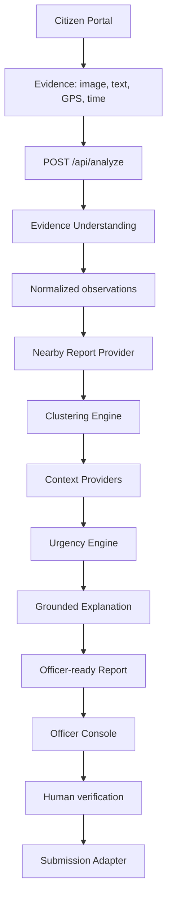

# 2. AI System Design — 20%

## Architecture

## การเลือกใช้ AI และ deterministic logic

| งาน | วิธี | เหตุผล |
|---|---|---|
| เข้าใจข้อความ/ภาพ | OpenAI structured output | ต้องเข้าใจภาษาธรรมชาติและหลักฐานหลายรูปแบบ |
| Normalize observations | Schema validation + aliases | ลดความแปรผันและควบคุม output |
| ค้นรายงานใกล้เคียง | Provider query | แยก data source ออกจาก business logic |
| จัดกลุ่ม | Deterministic spatial/temporal/semantic logic | ตรวจสอบและทำซ้ำได้ |
| Urgency score | Rule-based weighted factors | แสดง contribution และ audit ได้ |
| Explanation | Grounded AI generation | สรุปข้อมูลซับซ้อนโดยห้ามสร้างคะแนนใหม่ |
| Submission | Adapter | เปลี่ยนระบบปลายทางได้โดยไม่แก้ orchestration |

## Model boundary

Generative AI รับผิดชอบ:

- สกัดสิ่งที่สังเกตได้จากหลักฐาน
- สรุปคำอธิบายภาษาไทย
- สร้าง explanation จากข้อมูลที่ระบบให้

Generative AI ไม่รับผิดชอบ:

- ตัดสิน cluster membership ขั้นสุดท้าย
- คำนวณ urgency score
- ระบุสารเคมี
- ส่งเรื่องหรือสั่งการหน่วยงาน

## Data contracts

- Input ถูก validate ด้วย Zod
- AI output ใช้ strict structured schema
- `chemical_identity` ต้องเป็น `unknown`
- `needs_field_verification` ต้องเป็น `true`
- Frontend ไม่ได้รับ OpenAI API key

## Resilience

- หากไม่มี credentials หรือ AI provider ล้มเหลว ระบบใช้ deterministic fallback
- Demo scenario ยังคงได้ 8 reports, confidence 91% และ urgency 87/100
- Provider และ orchestration แยกชั้นเพื่อเปลี่ยน data source ได้

## ไฟล์สำคัญ

- `server/services/orchestrator.ts`
- `server/services/aiEvidence.ts`
- `server/services/clustering.ts`
- `server/services/urgency.ts`
- `server/services/aiExplanation.ts`
- `server/providers/incidentProviders.ts`
- `server/providers/submissionProviders.ts`
